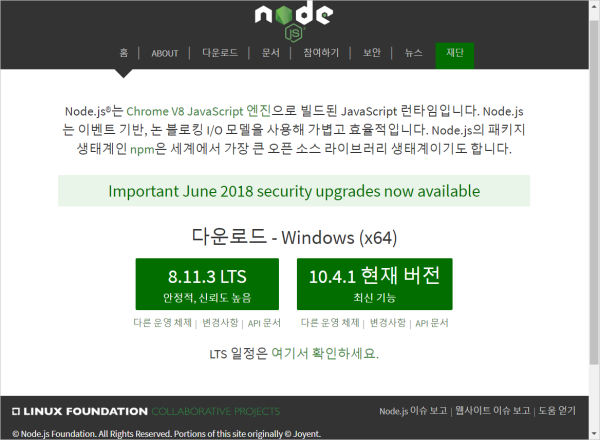

## Node.js 설치하기 - Mac OSX

Node.js에 대해 조금만 더 알아보죠. Node.js는 크롬의 JavaScript 엔진인 V8엔진에 기반하고 있어요. 구글이 만든 V8엔진을 이용해 자바스크립트를 웹브라우저가 아닌 다른 환경에서 실행되도록 만들었고, 자바스크립트가 폭발적으로 성장하는데 핵심적인 역할을 했죠.

Node.js는 JavaScript 런타임 자체를 의미하기도 하고, Node.js만의 API(Application Programming Interface)를 의미하기도 해요. Python이나 Ruby와 같이 서버측 웹애플리케이션 개발에 폭넓게 사용되고, 클라이언트 측 웹 개발에도 필수적인 존재가 되었어요.

더 자세한 이야기는 Node.js에 대해 본격적으로 알아볼 때 하기로 하고, 우선은 설치부터 해요.


### nvm을 이용해서 맥에 Node.js 설치하기

맥이나 리눅스에서 Node.js를 설치할 때는 nvm을 이용하는 것이 좋아요. NVM은 Node Version Manager의 줄임말로, 말 그대로 Node.js의 버전관리를 쉽게 할 수 있도록 도와주는 툴이에요.

상세한 설치 방법은 아래 링크를 참조해 주세요.

> [NVM으로 쉽게하는 Node.js 버전관리][nvm]


### Homebrew를 이용해서 설치하기

[Homebrew](https://brew.sh/){:target="_blank"}를 이용해서 손쉽게 설치할 수도 있어요.

Homebrew가 이미 설치되어 있다면, 터미널을 열고 설치하면 끝이죠.

```shell
brew install node
```


### 다운로드 받아서 설치하기

맥 인스톨러를 다운로드 받아서 Node.js설치하는 방법은 간답합니다. 다운로드 받고 설치하면 끝이죠. 하지만 nvm을 사용할 수 없는 환경이 아니라면 nvm을 사용하는 것을 추천해요. Node.js를 직접 다운로드 받아서 설치하려면 아래와 같이 하세요.

우선, Node.js 웹사이트에 접속합시다. https://nodejs.org/ko/

그러면 바로 다운로드 버튼이 보일 텐데요. LTS 버전이라고 되어있는 다운로드 링크를 클릭하면 바로 다운로드가 시작되요.




2018년 6월 현재는 8.11.3 LTS 버전이 가장 최신 버전이네요. LTS버전은 Long Term Support 버전이라는 말로, 유지보수가 지속적으로 되는 안정버전이라는 뜻이에요.

다운로드 받았으면 더블클릭해서 설치를 시작합니다. 설치가 시작되면 다음 버튼만 눌러줘도 쉽게 설치가 완료되네요. 중간에 설정을 건드릴 것은 없어요. 

설치가 완료되었으면 확인해 봐야겠죠. 이제 터미널을 사용할 시간입니다.


### Node.js 설치 확인하기

티미널이 무엇인지 아시는 분들은 바로 사용하시는 터미널에서 Node.js 설치상태를 확인해 볼 수 있어요.

터미널은 CLI 작업 환경이라고 불리고, 옛날 도스 시절 까만화면에 `C:/>` 하던 화면이에요. 맥 OSX의 화려한 그래픽 사용자 인터페이스(GUI) 없이, 명령어로만 원하는 작업을 할 수 있는 환경이죠.

맥에서는 스포트라이트를 실행하고 `terminal` 이라고 입력하고 엔터를 누르면 터미널을 실행할 수 있습니다. 

터미널 창을 열었으면 화면에 `node -v` 라고 입력해 봅시다.

```shell
node -v
v8.9.4
```

저처럼 설치한 Node.js의 버전이 표시된다면 성공적으로 설치가 된거에요.

> 저는 예전에 설치해 놓아서 버전이 조금 오래되었네요. v8.11.3 이 표시되면 제대로 설치된거겠죠.


[nvm]: /posts/nodejs/nvm

